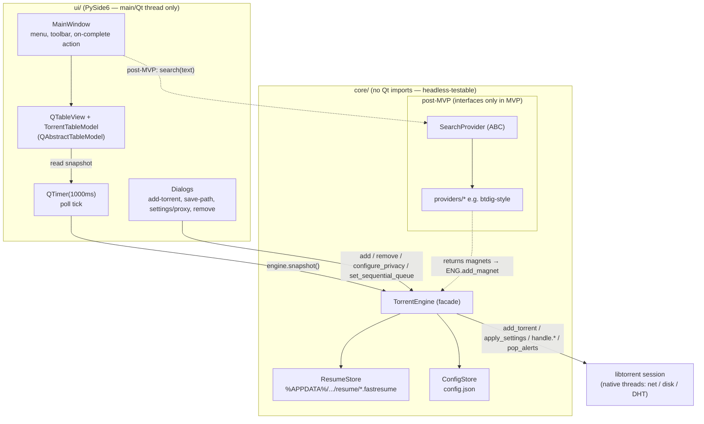

**한국어** | [English](ARCHITECTURE.en.md)

# 아키텍처 — pytorrent-desktop

상태: MVP 설계 (v0.1). 담당: system-architect. [`SCOPE.md`](SCOPE.md)의 범위와
[`core/engine.py`](../src/pytorrent_desktop/core/engine.py)의 스캐폴드를 구현
가능한 결정과 계약으로 구체화한다. **여기에는 실제 프로덕션 코드가 없다** —
developer가 이 문서를 기준으로 구현한다.

아래의 모든 API 사실은 이 저장소 `.venv`에 고정된 `libtorrent==2.0.13`
(`lt.version == "2.0.13.0"`)을 기준으로 검증되었다. 스캐폴드와 검증된 라이브러리가
불일치하는 부분은 **[CORRECTION]**으로 표시한다.

---

## 1. 컨텍스트 및 설계 제약

| 제약 | 값 | 설계에 미치는 영향 |
|---|---|---|
| 엔진 | `libtorrent==2.0.13` (2.0.x ABI) | 2.0 API: `state`는 enum, `paused`/`auto_managed`는 *플래그*; `info_hash()`는 v1 중심; 레주메는 `add_torrent_params` 라운드트립으로 처리. |
| GUI | PySide6 6.7–6.9 | Qt가 메인 스레드와 이벤트 루프를 소유. |
| Python | 3.11–3.13 | libtorrent용 3.14 휠이 아직 없음; 패키징은 3.12/3.13을 타겟으로 해야 함. |
| 레이어링 | `core/`는 **Qt import가 전혀 없음**; `ui/`는 `libtorrent`를 절대 import하지 않음 | `TorrentEngine` 파사드만이 유일한 접점. lint/test 규칙으로 강제. |
| MVP 동시성 | 1초 `QTimer`가 `engine.snapshot()`을 폴링 | MVP에서는 libtorrent 스레드가 Qt로 콜백하지 않음. 알림(alert) 기반은 post-MVP. |
| 플랫폼 | Windows 우선, PyInstaller `.exe`로 배포 | 경로는 `%APPDATA%` 사용; 패키징 시 네이티브 `libtorrent` `.pyd` + Qt DLL을 번들링. |

### 설계 원칙
1. **파사드가 곧 계약이다.** `ui/`는 오직 `TorrentEngine` + `TorrentStatus`(순수
   dataclass)에만 의존한다. `lt.*` 타입은 절대 이 경계를 넘지 않는다.
2. **MVP에 맞는 적정 규모로.** 알림 스레드 대신 폴링; 데이터베이스 대신 플랫 파일
   레이아웃; 비동기 대신 동기식 `add_torrent`. 각각은 파사드 시그니처를 바꾸지 않는
   post-MVP 업그레이드 경로가 문서화되어 있다.
3. **데이터 안전성은 타협 불가.** 정확히 맞춰야 하는 유일한 지점은 종료 시
   레주메 데이터 플러시(§4.3)다. 나머지는 다시 유도해낼 수 있지만, 매번 실행할 때마다
   토렌트를 처음부터 다시 체크하는 것은 크래시가 없더라도 정확성 실패다.

---

## 2. 컴포넌트 다이어그램



### 데이터 흐름 (MVP 정상 상태)
1. 사용자가 다이얼로그에서 조작 → `ui/`가 `TorrentEngine` 메서드를 호출 (메인 스레드).
2. `TorrentEngine`이 libtorrent 세션을 호출; 네트워크/디스크 작업은 libtorrent
   자체 스레드가 수행.
3. 매 1000ms마다 메인 스레드에서 `QTimer`가 발화 → `engine.snapshot()`이 각
   핸들의 현재 `status()`를 읽어 `list[TorrentStatus]`를 반환.
4. `TorrentTableModel`이 스냅샷을 행(row)에 diff하여 `dataChanged`를 emit하고
   뷰가 다시 그려진다. **UI→libtorrent 방향으로는 명시적 파사드 호출을 통해서만
   데이터가 흐르고, libtorrent→UI 방향으로는 UI가 `snapshot()`을 당겨오는 것 외에는
   아무것도 흐르지 않는다.**

### 모듈 맵
```
src/pytorrent_desktop/
  __main__.py            entry point; builds engine + QApplication + MainWindow
  core/
    engine.py            TorrentEngine, TorrentStatus  (exists — extend per §3)
    resume.py            ResumeStore (new — §5)
    config.py            ConfigStore, AppPaths (new — §7)
    errors.py            engine exception types (new — §8)
    search/              post-MVP; base.py = SearchProvider ABC (§9)
  ui/
    app.py               QApplication wiring, 1s QTimer
    main_window.py       MainWindow
    torrent_model.py     TorrentTableModel (QAbstractTableModel)
    dialogs/             add_magnet, save_path, settings, remove_confirm
```

---

## 3. `TorrentEngine` API 계약

이 파사드는 **단일 스레드 전용**이다: 모든 메서드는 Qt 메인 스레드에서만 호출되도록
설계되었다. 이는 의도적인 MVP 단순화로, `self._handles`에 대한 락(lock)이 필요
없어진다. 이는 문서화되어 강제되며(`threading.get_ident()`에 대한 디버그 assert),
post-MVP의 알림 기반 모델과도 호환된다 — 그 모델에서는 워커 스레드가 엔진을 직접
호출하는 대신 Qt 시그널을 통해 메인 스레드로 결과를 전달한다.

### 3.1 `TorrentStatus` — 확정된 필드

스캐폴드 dataclass를 확장한다. 모든 필드는 검증된 2.0.13 `torrent_status` 속성에
매핑된다(모두 존재함을 확인함). `frozen=True`를 유지해 스냅샷을 불변 값 객체로
모델에 안전하게 전달할 수 있게 한다.

| 필드 | 타입 | 출처 (`s = handle.status()`) | 비고 |
|---|---|---|---|
| `info_hash` | `str` | `_handles`의 키 (16진수 v1) | 안정적인 행 식별자; `info_hashes()`에 대해서는 §3.5 참조. |
| `name` | `str` | `s.name` 또는 `"(fetching metadata…)"` | magnet의 경우 메타데이터가 없으면 빈 값. |
| `total_bytes` | `int` | `s.total_wanted` | 선택된 바이트 총량; 메타데이터 이전에는 `0`. |
| `downloaded_bytes` | `int` | `s.total_wanted_done` | **추가됨** — "X of Y" 텍스트를 가능하게 함. |
| `progress` | `float` | `s.progress` | 0.0–1.0. |
| `download_rate` | `int` | `s.download_rate` | bytes/s. |
| `upload_rate` | `int` | `s.upload_rate` | bytes/s. |
| `num_peers` | `int` | `s.num_peers` | 총 연결된 피어 수. |
| `num_seeds` | `int` | `s.num_seeds` | **추가됨** — MVP 목록은 피어를 보여주며, 함께 들고 다니는 비용이 저렴함. |
| `state` | `str` | `_STATE_LABELS[s.state]` | Enum→라벨 (§3.4). |
| `is_paused` | `bool` | `bool(s.flags & lt.torrent_flags.paused)` | 상태가 아니라 플래그. |
| `is_finished` | `bool` | `s.progress >= 1.0` 또는 state가 {finished, seeding} 중 하나 | **추가됨** — 완료 후 동작(scope §9)을 구동. |
| `queue_position` | `int` | `s.queue_position` | **추가됨** — 큐에 없거나 시딩 중이면 `-1`; 큐 UI(§6)를 구동. |
| `error` | `str \| None` | `str(s.errc.message()) if s.errc.value() else None` | **추가됨** — 토렌트별 에러를 노출 (§8). |
| `save_path` | `str` | `s.save_path` | **추가됨** — "폴더 열기" + 삭제 다이얼로그에 필요. |

**스캐폴드에 대한 [CORRECTION]:** libtorrent 2.0의 `states` enum에는 **`error`
상태가 없고**, **`queued`/`allocating` 상태도 없다.** 에러는 `status().errc`를
통해 보고되며, 일시정지/큐잉은 플래그 + `queue_position`으로 전달된다. 따라서
스냅샷은 `errc`를 명시적으로 읽어야 한다 — 그렇지 않으면 치명적 에러가 난 토렌트가
낡은 비-에러 라벨을 그대로 보여주게 된다. 스캐폴드의 `_STATE_LABELS`는 이미 2.0의
전체 enum(`checking_files`, `downloading_metadata`, `downloading`, `finished`,
`seeding`, `checking_resume_data`)을 커버하므로 그대로 유지하되, `errc` 읽기를
추가한다.

### 3.2 메서드 계약 표

스레드 컬럼: **main** = Qt 메인 스레드에서만 호출되어야 함. 모든 메서드는 동기식이며
빠르게 반환한다(libtorrent에 작업을 큐잉할 뿐 네트워크/디스크에서 블록하지 않음)
**단, `shutdown()`은 예외**로, 레주메 플러시(§4.3)에서 제한된 타임아웃까지 블록한다.

| 메서드 | 시그니처 | 입력 계약 | 반환값 | 예외 | 스레드 |
|---|---|---|---|---|---|
| `__init__` | `(config: EngineConfig \| None = None)` | §3.3 참조 — 단순 포트가 아니라 config 객체를 받음. | — | 세션 바인딩 실패 시 `EngineInitError`. | main |
| `describe` | `() -> str` | — | `"libtorrent 2.0.13.0"` | — | any (읽기 전용 상수) |
| `add_torrent_file` | `(torrent_path, save_path) -> str` | `torrent_path`가 존재하고 파싱 가능; `save_path`는 쓰기 가능한 디렉터리. | `info_hash` (hex) | `InvalidTorrentError`, `DuplicateTorrentError`, `SavePathError` | main |
| `add_magnet` | `(magnet_uri, save_path) -> str` | `magnet_uri`가 유효한 `magnet:?xt=urn:btih:`(또는 btmh) URI. | `info_hash` (hex) | `InvalidMagnetError`, `DuplicateTorrentError`, `SavePathError` | main |
| `pause` | `(info_hash) -> None` | `info_hash`가 알려진 값. | — | `UnknownTorrentError` | main |
| `resume` | `(info_hash) -> None` | 알려진 값 | — | `UnknownTorrentError` | main |
| `remove` | `(info_hash, *, delete_data=False) -> None` | 알려진 값 | — | `UnknownTorrentError` | main |
| `snapshot` | `() -> list[TorrentStatus]` | — | 알려진 핸들당 하나씩, 엔진 순서대로 | — (절대 예외를 던지지 않음; 토렌트별 에러는 `TorrentStatus.error`에 담김) | main |
| `set_sequential_queue` | `(one_at_a_time: bool) -> None` | — | — | — | main |
| `move_in_queue` | `(info_hash, direction: Literal["up","down","top","bottom"]) -> None` | 알려진 값 | — | `UnknownTorrentError` | main |
| `configure_privacy` | `(cfg: ProxyConfig \| None) -> None` | `None`이면 프록시 비활성화(직접 연결 모드). | — | `ProxyConfigError` (잘못된 host/port) | main |
| `save_all_resume` | `(timeout_s: float = 5.0) -> int` | — | 저장된 개수 | — | main (타임아웃까지 블록) |
| `shutdown` | `(timeout_s: float = 10.0) -> None` | 멱등(idempotent) | — | — (best-effort; 실패는 로그로 남김) | main (타임아웃까지 블록) |

### 3.3 Config 객체 (단순 `listen_port` int를 대체)

`__init__`은 패키징/테스트에서 경로를 주입할 수 있고 설정 항목이 늘어나도
시그니처가 바뀌지 않도록 작은 frozen dataclass를 받아야 한다:

```
EngineConfig:  listen_port: int = 6881
               data_dir: Path                # AppPaths.data_dir (§7)
               enable_dht: bool = True
               proxy: ProxyConfig | None = None
               sequential_queue: bool = True   # scope §6 default

ProxyConfig:   host: str
               port: int
               username: str | None = None
               password: str | None = None
               kill_switch: bool = True
```

### 3.4 상태 매핑 (그대로 유지, 검증됨)
`_STATE_LABELS`는 2.0의 여섯 가지 `torrent_status.states` 멤버를 매핑한다.
`snapshot()`은 알 수 없는 값에 대해 `str(s.state)`로 폴백한다 — 방어적으로 그대로
유지한다.

### 3.5 식별 관련 참고 — `info_hash()` vs `info_hashes()`
스캐폴드는 `str(handle.info_hash())`(hex)를 사용한다. 2.0에서 `info_hash()`는
v1 중심 접근자이며 `info_hashes()`(v1/v2 쌍)로 대체되도록 deprecated 되었다.
MVP(v1 토렌트/magnet)에서는 `info_hash()`로 충분하며 안정적인 40자리 16진수 키를
만들어낸다. **결정:** 불필요한 변경을 피하기 위해 MVP에서는 `info_hash()`를
유지하되, 이를 하나의 private 헬퍼 `_key(handle) -> str`로 중앙화하여 이후
`handle.info_hashes().v1`로 전환할 때 한 줄만 고치면 되게 한다. 중복 감지(§8)는
이 문자열을 키로 사용한다.

---

## 4. 동시성 모델

### 4.1 스레드 인벤토리
- **libtorrent 내부 스레드(네이티브, 세션이 소유):** 네트워크 I/O, 디스크 I/O,
  DHT, 해셔(hasher) 풀. 우리는 이들을 직접 건드리지 않고 작업(add/pause/settings)을
  제출하고 알림(alert)을 소비할 뿐이다.
- **Qt 메인 스레드(우리 쪽):** `TorrentEngine`, `self._handles`, 모델, 그리고
  모든 위젯을 건드리는 *유일한* 스레드. `QApplication` 이벤트 루프가 여기서 산다.
- **MVP에는 우리 자체 워커 스레드가 없다.** 이것이 핵심 단순화 지점이다.

### 4.2 1초 폴링 루프 (MVP)
- `QTimer(interval=1000, parent=MainWindow)` 하나가 `engine.snapshot()`을
  호출해 그 결과를 `TorrentTableModel.apply()`로 넘기는 슬롯에 연결된다.
- `snapshot()`은 핸들마다 `handle.status()`를 호출한다. MVP가 예상하는 토렌트
  개수(한 자릿수; 순차 큐를 쓰면 활성은 하나)에서는 이 비용이 사소하다.
- **왜 알림이 아니라 폴링인가(MVP):** `handle.status()`는 동기식 로컬 읽기라서
  스레드 간 마샬링이나 알림 큐 소비가 필요 없다. UI는 언제나 *현재* 상태만
  보여줄 뿐 이벤트 로그를 보여주지 않으므로, 일시적인 이벤트를 놓칠 일도 없다.
  이 규모에서는 단순함이 이긴다.
- **[성능 가드]** post-MVP에서 목록이 커지면, 읽기 쪽을 `session.post_torrent_updates()`
  + 타이머 틱마다 하나씩 소비하는 `state_update_alert`(델타 업데이트) 방식으로
  전환한다 — 여전히 메인 스레드에서. 이는 파사드를 바꾸지 않는다 — `snapshot()`이
  내부적으로 알림에서 갱신되는 캐시를 유지하면 된다. 완전한 알림 기반 푸시(워커
  스레드가 Qt 시그널을 emit)는 그다음 단계이며, `configure_privacy`/추가 작업이
  지금 동기식으로 남아 있는 이유이기도 하다.

### 4.3 종료 시퀀스 — 데이터 손실이 걸린 지점 (가장 중요)

**목표:** 진행 중인 다운로드는 다음 실행 시 재체크나 재다운로드 없이 이어져야
한다. 그러려면 libtorrent가 레주메 데이터를 만들어낸 *이후에* 그것을 파일에
써야 한다. `save_resume_data()`는 **비동기**다: 즉시 반환하고 데이터는 나중에
`save_resume_data_alert`로 도착한다. 그 알림 이전에 파일을 쓰면 데이터 손실이다.
정확한 순서는 다음과 같다:

```
shutdown(timeout_s):
  1. session.pause()                       # stop new peer/piece activity
  2. (optional) apply a short stop-tracker announce; not required for resume safety
  3. outstanding = 0
     for handle in self._handles.values():
         if not handle.is_valid(): continue
         handle.save_resume_data(
             lt.torrent_handle.save_info_dict          # so magnet torrents reload
             | lt.torrent_handle.flush_disk_cache      # durable on-disk state
         )                                             # NOTE: omit only_if_modified at shutdown
         outstanding += 1
  4. deadline = now + timeout_s
     while outstanding > 0 and now < deadline:
         session.wait_for_alert(200ms)                # block up to 200ms for the next batch
         for a in session.pop_alerts():
             if isinstance(a, lt.save_resume_data_alert):
                 buf = lt.write_resume_data_buf(a.params)   # 2.0 API — bencoded bytes
                 ResumeStore.write(key_from(a.params), buf) # atomic write (§5)
                 outstanding -= 1
             elif isinstance(a, lt.save_resume_data_failed_alert):
                 log.warning("resume save failed: %s", a.error.message())
                 outstanding -= 1                      # MUST decrement or we hang to timeout
  5. if outstanding > 0: log.warning("%d torrents did not flush before timeout", outstanding)
  6. del self._session   # drop the session; native threads join on destruction
```

이 로직이 의존하는 검증된 2.0.13 사실(모두 프로빙으로 존재 확인): `lt.torrent_handle`의
`save_info_dict`, `flush_disk_cache`, `only_if_modified` 플래그; `save_resume_data_alert`와
`save_resume_data_failed_alert` 알림; 헬퍼 `lt.write_resume_data_buf`; 그리고
`session.wait_for_alert` / `pop_alerts` / `is_valid` / `need_save_resume_data`.

**developer를 위한 핵심 규칙:**
- **실패(failed) 알림에서도 반드시 `outstanding`을 감소시켜라.** 이 로직이 멈추는
  1순위 원인은 성공만 카운트하는 것이다 — 아직 메타데이터가 없는 토렌트(magnet이
  여전히 가져오는 중)는 실패 알림이 뜨는데, 이를 카운트하지 않으면 타임아웃까지
  블록된다.
- **`save_info_dict`는 필수다** — magnet으로 추가되어 메타데이터를 이미 받은
  토렌트가 메타데이터를 다시 받지 않고도 레주메 데이터에서 복원되게 하기 위함.
- **`only_if_modified`는 *주기적* 저장을 위한 것이지 종료 시가 아니다.** 종료
  시에는 조건 없이 저장하고, 주기적으로는 불필요한 디스크 부하를 막기 위해
  `handle.need_save_resume_data()`로 게이트한다.
- **`shutdown()`은 멱등이어야 한다**(`self._closed` 플래그로 보호) — 이는
  `QApplication.aboutToQuit`과 `MainWindow.closeEvent` 양쪽에 연결되며, 둘 다
  발생할 수 있다.
- 스캐폴드의 현재 `shutdown()`은 `session.pause()`만 호출한다 — 그것이 바로
  이 절에서 해결하는 TODO다.

### 4.4 완료 후 동작 (scope §9)
폴링 틱마다 평가된다: 순차 큐가 비었을 때(다운로드/체크/메타데이터 수신 상태인
토렌트가 없고 이번 세션에서 최소 하나가 완료되었을 때) 옵트인 동작이 활성화되어
있으면 `MainWindow`가 종료 또는 시스템 종료를 트리거한다. Windows에서 시스템
종료는 `ctypes`로 `ExitWindowsEx`/`shutdown.exe /s /t`를 호출하는 것이다;
**OS가 내려가기 전에 레주메 데이터가 플러시되도록 항상 먼저 `engine.shutdown()`을
실행해야 한다.**

---

## 5. 레주메 데이터 영속화

### 5.1 무엇을 / 언제 / 어디에 / 어떤 형식으로
- **무엇을:** 토렌트당 `.fastresume` 파일 하나 = `lt.write_resume_data_buf(alert.params)`가
  만드는 bencoded 버퍼. `save_info_dict`가 있으면 info-dict가 포함되므로, magnet
  토렌트는 메타데이터를 다시 받지 않고도 재시작에서 살아남는다.
- **어디에:** `%APPDATA%\pytorrent-desktop\resume\<info_hash>.fastresume`
  (플랫 디렉터리 하나, 파일명 = 40자리 16진수 info-hash → 충돌 없음, grep으로 쉽게 찾음).
- **형식:** libtorrent의 bencoded 레주메 blob(불투명한 데이터; 우리는 이를 절대
  파싱하지 않고 `read_resume_data`/`write_resume_data_buf`로 라운드트립만 한다).
- **언제 쓰이는가:**
  1. **추가 시** — 성공적으로 추가된 직후 즉시 저장을 한 번 요청해, 추가 후
     강제 종료된 토렌트도 `save_path`/파라미터가 복원되게 한다. (비용이 적고,
     첫 알림은 한 틱 안에 도착한다.)
  2. **주기적으로** — 60초마다, `handle.need_save_resume_data()`가 참인 각
     핸들에 대해 저장을 요청한다(`only_if_modified` 방식 게이팅). 이는 크래시/정전
     시 최악의 손실을 약 60초치 조각 진행분으로 한정한다.
  3. **`torrent_finished_alert` 발생 시** — 완료된 토렌트가 재체크가 아니라
     시딩으로 복원되도록 한 번 저장한다.
  4. **종료 시** — §4.3의 전체 플러시.
- 주기적 + 완료 시 저장은 종료 시와 *동일한* 알림 소비 경로를 공유한다; 폴링
  틱의 알림 소비(§4.2 성능 가드)는 무엇이 요청했든 `save_resume_data_alert`가
  나타나면 그때그때 파일을 쓴다.

### 5.2 원자적 쓰기
`<info_hash>.fastresume.tmp`에 쓴 다음 `os.replace()`로 최종 이름으로 옮긴다.
`os.replace`는 Windows/NTFS에서 원자적이므로, 쓰는 도중 크래시가 나도 이전의
정상 레주메 파일이 절대 손상되지 않는다.

### 5.3 로드 순서 (시작 시)
```
on startup, before showing the window:
  for f in sorted(resume_dir.glob("*.fastresume")):
      buf = f.read_bytes()
      try:    atp = lt.read_resume_data(buf)          # -> add_torrent_params
      except: quarantine(f); continue                 # corrupt/old-format → move to resume/bad/
      atp.save_path = atp.save_path or default_save_path
      apply flags: auto_managed (if sequential queue on), paused-as-persisted
      handle = session.add_torrent(atp)
      self._register(handle)
```
- 순차 큐가 켜져 있을 때 토렌트는 **auto-managed**로 다시 추가되어, libtorrent가
  (레주메 데이터에 영속화된) `queue_position`으로 큐 순서를 복원하게 한다. §6 참조.
- 파싱에 실패한 레주메 파일(포맷 드리프트, 손상)은 삭제하지 않고 `resume\bad\`로
  옮긴다 — 복구 가능하며 시작을 절대 막지 않는다.
- 파일로 추가된 토렌트의 `.torrent` 메타데이터는 `save_info_dict`를 통해 레주메
  blob 안에 들어 있다; 원본 `.torrent`를 별도로 복사해두지는 **않는다**.
  (post-MVP에서는 `torrents/` 캐시를 둘 수도 있으나 MVP에는 필요 없다.)

---

## 6. 순차 단독 다운로드 큐 (scope §6)

libtorrent는 이미 auto-managed 큐를 통해 한 번에 하나씩 처리하는 기능을 구현하고
있다. 설계는 다음과 같다:

- **세션 설정:** 토글이 켜져 있으면 `active_downloads = 1`(스캐폴드가 이미 적용
  중), 꺼져 있으면 `active_downloads = -1`(무제한). 시딩을 제한하지 않도록
  `active_limit`도 충분히 높게 설정하고, 멈춰 있는 토렌트(피어 없음)가 단일
  슬롯을 영원히 붙잡지 않도록 `dont_count_slow_torrents = True`를 고려한다 —
  세 키 모두 문제 없이 적용됨을 검증함.
- **토렌트는 반드시 auto-managed로 추가되어야 한다.** 이것이 스캐폴드가 표시한
  TODO다. 모든 추가 시점과 모든 레주메 로드 시점에 `lt.torrent_flags.auto_managed`를
  설정한다(사용자가 명시적으로 강제 시작한 경우는 제외). 오직 auto-managed
  토렌트만 큐에 참여한다; auto-managed가 아닌 토렌트는 `active_downloads`를
  우회하여 보장을 깨뜨린다.
- **순서**는 `queue_position`이다(0이 맨 앞). 레주메 데이터에 영속화되므로 순서는
  재시작 후에도 유지된다.
- **UI 재정렬 훅:** `move_in_queue(info_hash, "up"|"down"|"top"|"bottom")`는
  `handle.queue_position_up/down/top/bottom()`에 매핑된다(모두 존재 확인됨).
  테이블은 `TorrentStatus.queue_position`에 바인딩된 `#` 컬럼을 보여주거나
  우클릭 "위로/아래로 이동"을 제공한다. 재정렬 후 다음 `snapshot()`이 새 위치를
  반영한다 — 수동 모델 관리가 필요 없다.
- **UI에 문서화할 의미론:** "순차 단독 다운로드"는 *한 번에 몇 개의 토렌트가
  다운로드되는지*(하나)를 제어하며, 이는 `lt.torrent_flags.sequential_download`
  (하나의 토렌트 내에서 조각을 순서대로 다운로드)와는 다른 개념이다. 우리는
  토렌트별 sequential-download 플래그를 설정하지 **않는다**; 설정 화면의 명칭이
  이 혼동을 피해야 한다.

---

## 7. 설정 및 데이터 경로 레이아웃

루트: `%APPDATA%\pytorrent-desktop\` (즉 `os.getenv("APPDATA")` →
`C:\Users\<user>\AppData\Roaming\pytorrent-desktop`). 테스트가 임시 디렉터리를
가리킬 수 있도록 `core/config.py`의 `AppPaths` 헬퍼에 중앙화한다.

```
%APPDATA%\pytorrent-desktop\
  config.json                  app settings (see schema below)
  resume\
    <info_hash>.fastresume     one per torrent (§5)
    bad\                       quarantined unparseable resume files
  logs\
    pytorrent.log              rotating (e.g. 5×1 MB), also stderr in dev
  session\                     (optional) .session_state / DHT node cache for faster warm start
```

`config.json` (MVP 스키마 — 마이그레이션이 가능하도록 버전 관리됨):
```json
{
  "schema_version": 1,
  "listen_port": 6881,
  "default_save_path": "C:\\Users\\me\\Downloads",
  "sequential_queue": true,
  "proxy": { "enabled": false, "host": "", "port": 1080,
             "username": null, "kill_switch": true },
  "on_complete": { "action": "none" }
}
```
- **비밀 정보:** SOCKS5 비밀번호는 MVP에서 `config.json`에 평문으로 저장하지
  **않는다.** 선택지: (a) 저장하지 않고 세션마다 물어보거나, (b) Windows DPAPI
  (`win32crypt`/`ctypes CryptProtectData`)로 저장. MVP 결정: host/port/user는
  저장하고, 비밀번호는 메모리에만 유지(활성화할 때 프롬프트). 설정 다이얼로그가
  이에 맞게 구성되도록 문서화해 둔다.
- 설정은 시작 시 한 번 `EngineConfig`/UI 상태로 로드되고 변경 시 저장된다(§5.2와
  동일한 원자적 교체). 실시간 파일 감시는 없다.
- **PyInstaller 참고:** `.exe` 옆에는 절대 쓰지 않는다(읽기 전용 Program Files
  위치일 수 있음). 항상 `%APPDATA%`를 사용한다. `AppPaths.ensure()`가 최초
  실행 시 트리를 생성한다.

---

## 8. 에러 처리 전략

엔진이 던지는 모든 에러는 하나의 기본 클래스 `EngineError`(`core/errors.py`)를
상속하므로, `ui/`는 `except EngineError`로 일반 다이얼로그를 처리하고 몇 가지만
특별 처리하면 된다. 엔진은 libtorrent 예외/알림을 이 타입화된 에러로 변환한다;
**libtorrent의 원시 `RuntimeError`가 `ui/`에 도달하는 일은 없다.**

| 케이스 | 감지 방법 | 엔진 동작 | UI 동작 |
|---|---|---|---|
| **잘못된 magnet** | `lt.parse_magnet_uri`가 예외 발생 | `InvalidMagnetError(uri)` 발생 | 추가 다이얼로그에서 인라인 검증; 다이얼로그를 닫지 않음 |
| **잘못되었거나 손상된 `.torrent`** | `lt.torrent_info(path)`가 예외 발생 | `InvalidTorrentError(path)` 발생 | 에러 다이얼로그, 파일 선택기는 열린 채로 유지 |
| **중복 추가(동일 info_hash)** | `self._handles`에 키가 이미 있음, **또는** `add_torrent_alert.error`가 중복을 나타냄 | `DuplicateTorrentError(info_hash)` 발생 (두 번째 핸들을 추가하지 않음) | "이미 목록에 있음" 토스트; 기존 행을 선택 |
| **디스크 공간 부족 / 쓰기 실패** | 폴링 소비 시 `file_error_alert` / `torrent_error_alert`; `status().errc`를 통해 노출 | 해당 토렌트의 `TorrentStatus.error`를 표시; 자동 일시정지 | 빨간 행 + 에러 메시지 툴팁; 재시도/재배치 제공 |
| **저장 경로 쓰기 불가 / 없음** | 추가 전 사전 점검 `os.access(dir, W_OK)` + 디렉터리 존재 확인 | `SavePathError(path)` 발생 | 다운로드 시작 전 저장 경로 다이얼로그에서 에러 표시 |
| **알 수 없는 info_hash** (삭제된 토렌트에 대한 제어 호출) | `self._handles`에 키가 없음 | `UnknownTorrentError` 발생 | 무시/로깅(보통 삭제와의 무해한 경쟁 상태) |
| **프록시 설정 오류** (잘못된 host/port) | `configure_privacy`에서 검증 | `ProxyConfigError` 발생 | 설정 다이얼로그 검증 |
| **레주메 저장 실패** | `save_resume_data_failed_alert` | 로그 남기고 outstanding 감소 (§4.3) | 없음 (best-effort) |

교차 관심사(Cross-cutting):
- **비용이 적을 때는 사후 처리보다 사전 점검을.** `add_torrent` 호출 *전에*
  magnet 문법과 저장 경로 쓰기 가능 여부를 검증해, 대부분의 실패가 반쯤 추가된
  핸들을 만들지 않게 한다.
- **중복 감지는 다중 방어(defense-in-depth)다:** 먼저 `_handles` 맵을 확인하고
  (동기식, 같은 세션 내 재추가를 잡음) *그리고* `add_torrent_alert.error`도
  존중한다(경쟁 상태를 잡음). libtorrent 자체가 중복 info-hash 등록을 거부하므로,
  우리는 예외를 그대로 노출하는 대신 깔끔하게 표면화한다.
- **토렌트별 에러는 앱이나 스냅샷을 절대 크래시시키지 않는다.** `snapshot()`은
  절대 예외를 던지지 않는다; 실패한 토렌트는 `error != None`인 행으로 나타날
  뿐이다.

---

## 9. post-MVP 검색 프로바이더 인터페이스 (스케치 수준)

인터페이스뿐 — **MVP에는 크롤러도, 번들된 프로바이더도, 네트워크 코드도 없다.**
이는 접점을 고정해 두어, btdig 스타일의 프로바이더를 `ui/`나 `core/engine.py`를
건드리지 않고 나중에 끼워 넣을 수 있게 한다.

```python
# core/search/base.py  (post-MVP)
from dataclasses import dataclass
from typing import Protocol, runtime_checkable

@dataclass(frozen=True)
class SearchResult:
    title: str
    size_bytes: int | None      # None if the provider can't report size
    seeders: int | None
    leechers: int | None
    magnet: str                 # magnet: URI — the only thing the engine needs

@runtime_checkable
class SearchProvider(Protocol):
    id: str                     # stable key, e.g. "btdig"
    display_name: str           # shown in the provider picker
    requires_optin: bool        # True → gated behind the legal-notice acceptance

    def query(self, text: str, *, limit: int = 50) -> list[SearchResult]:
        """Search third-party service for `text`. Network-bound; run OFF the Qt
        main thread (QThreadPool/worker). Must raise SearchError on failure —
        never partial/garbage results. No result is auto-added; the user picks a
        row, which calls TorrentEngine.add_magnet(result.magnet, save_path)."""
```

통합 계약:
- 프로바이더는 명시적 레지스트리(entry-point 목록이나 `providers/__init__.py`
  맵)를 통해 발견된다 — 인터넷에서 **자동으로 import되지 않는다.**
- UI는 워커 스레드에서 `query()`를 실행하고 Qt 시그널을 통해 `list[SearchResult]`를
  결과 테이블로 마샬링한다(이곳이 앱에서 처음으로 메인 스레드가 아닌 작업이
  등장하는 지점이다; 엔진 파사드는 여전히 메인 스레드 전용을 유지하는데, 워커가
  메인 스레드로 결과를 전달한 *이후에만* `add_magnet`을 호출하기 때문이다).
- MVP 이후 릴리스에서 모든 프로바이더는 `requires_optin=True`로 배포된다; 검색
  패널은 사용자가 법적 고지(README/SCOPE)를 수락하기 전까지 숨겨져 있다. 우리는
  명시적으로 DHT 크롤러/인덱서를 만들지 **않으며**, 저작권 침해 사이트를 겨냥한
  프로바이더를 번들하지 **않는다**(scope의 non-goal).

---

## 10. 패키징 아키텍처

### 10.1 PyInstaller: one-folder vs one-file
| | one-folder (`--onedir`) | one-file (`--onefile`) |
|---|---|---|
| 시작 속도 | 빠름(압축 해제 불필요) | 느림(실행할 때마다 `%TEMP%`에 자체 압축 해제) |
| 네이티브 의존성 (`libtorrent.pyd`, Qt DLL, `platforms/qwindows.dll`) | dist 디렉터리에 그대로 보여서 맞추기 가장 쉬움 | 압축되어 있어 가끔 플러그인 경로 문제 발생 |
| 배포 | 폴더 하나(zip하거나 Inno Setup에 넘김) | 단일 `.exe` |
| 백신 마찰 | 낮음 | 높음(자체 압축 해제 실행 파일은 더 자주 오탐됨) |

**결정:** **one-folder**를 주 산출물로 빌드한다.
- post-MVP **Inno Setup** 설치 프로그램(사용자가 시작 메뉴 바로가기, 제거
  프로그램, magnet 핸들러를 받는 방법이기도 함)의 안정적인 기반이 된다.
- 시작이 더 빠르고 Qt 플러그인 경로 문제가 적다.
- 단일 파일을 원하는 사용자를 위해 편의용 "포터블" 다운로드로 **one-file** `.exe`도
  함께 제공한다(느린 시작을 감수). scope의 수용 기준 #10("Python/환경 설정 없이
  독립 실행형 PyInstaller `.exe`로 실행")은 둘 중 어느 쪽으로도 충족된다; one-folder도
  폴더 안에 단일 실행 가능한 `.exe`를 제공한다.

### 10.2 반드시 번들되어야 하는 것
- 네이티브 **`libtorrent` `.pyd`**와 그 런타임 DLL(OpenSSL 등 — 보통 자동으로
  포함되지만 클린 VM 스모크 테스트로 검증할 것).
- **PySide6/Qt**: `platforms/qwindows.dll` 플러그인은 필수; Qt 플러그인 경로가
  수집되는지 확인(PyInstaller의 PySide6 훅이 이를 처리하지만, MVP CI는 Python/Qt가
  설치되지 않은 머신에서 빌드된 `.exe`를 스모크 테스트해야 한다 — 이것이 수용
  기준 #10과 #11이다).
- LICENSE와 법적 고지를 함께 배포한다.

### 10.3 post-MVP 설치 프로그램 + magnet 핸들러 (연결 지점)
- **Inno Setup**이 one-folder dist를 소비 → 바로가기와 제거 프로그램이 포함된
  `setup.exe`를 만든다.
- **Magnet 프로토콜 핸들러**는 앱이 아니라 설치 프로그램이 아래와 같이 등록한다:
  ```
  HKEY_CLASSES_ROOT\magnet
      (default) = "URL:magnet"
      "URL Protocol" = ""
  HKEY_CLASSES_ROOT\magnet\shell\open\command
      (default) = "\"C:\Path\pytorrent-desktop.exe\" \"%1\""
  ```
  (관리자 권한이 필요 없도록 사용자별 설치는 `HKEY_CURRENT_USER\Software\Classes\magnet`에
  쓴다.) 따라서 앱의 진입점은 위치 인자로 `magnet:` 인자를 받아 `add_magnet`으로
  라우팅해야 한다(실행 중이 아니면 앱을 열거나, 실행 중인 단일 인스턴스로 전달).
  나중에 핸들러 연결이 설정만 바꾸면 되도록 지금 `__main__.py`가 선택적 URI
  인자를 받도록 설계한다.

### 10.4 빌드/CI 참고 (cicd-engineer 대상)
Windows 러너, Python 3.12(휠 가용성), `uv pip install -e ".[build]"`,
저장소에 커밋된 `pyinstaller` spec, 그리고 **클린 러너에서 빌드된 `.exe`를
실행해 작고 합법적인 토렌트를 100%까지 받는 스모크 테스트** — 이것이 scope
수용 기준 #10 + #11이며 릴리스 태그를 게이트해야 한다.

---

## 열린 질문 / 리스크

1. **DHT를 위한 SOCKS5 UDP** (§11 프라이버시 참조): 프록시가 UDP ASSOCIATE를
   지원하지 않으면 DHT/uTP는 프록시를 통할 수 없다. Kill-switch 설계
   (`kill_switch`가 켜져 있으면 DHT/LSD/UPnP 비활성화)로 이를 회피하지만 피어
   발견을 트래커 전용으로 축소시킨다. product-lead와 기대되는 UX를 확인할 것.
2. **`force_proxy`는 deprecated된 2.0 별칭이다** — `apply_settings`에서 여전히
   존재하고 받아들여지지만(검증됨), `anonymous_mode` + `proxy_hostnames`가
   공식적인 메커니즘이다. §11 참조.
3. **비밀번호 저장** (§7): MVP는 메모리에만 유지; 사용자가 세션마다 재입력하는
   것을 감내할지, 아니면 지금 DPAPI에 투자할지 확인 필요.
4. **v2/하이브리드 토렌트:** MVP는 `info_hash()`(v1)를 키로 사용한다. 하이브리드
   토렌트도 동작하지만, 나중에 `info_hashes().v1`이 필요해지면 키 헬퍼(`_key`)가
   유일한 전환 지점이어야 한다.

---

## 11. 프라이버시 / kill-switch 설계 (scope §8) — 상세

이 절은 보안에 민감한 부분이며, 정확한 설정 조합은 2.0.13 기준으로 검증되었다.

### 11.1 프록시가 구성되었을 때 적용되는 설정
```python
session.apply_settings({
    "proxy_type": lt.proxy_type_t.socks5,        # or socks5_pw if username set
    "proxy_hostname": cfg.host,
    "proxy_port": cfg.port,
    "proxy_username": cfg.username or "",
    "proxy_password": cfg.password or "",
    "proxy_hostnames": True,          # resolve peer/tracker DNS THROUGH the proxy — anti-DNS-leak
    "proxy_peer_connections": True,   # peer connections go via proxy
    "proxy_tracker_connections": True,# tracker announces go via proxy
    "anonymous_mode": True,           # the real enforcement: no identity leak, requires a proxy
    # kill switch (see 11.2): when ON, also disable side channels that bypass the proxy
})
```
위의 모든 키는 2.0.13의 `apply_settings`에서 프로빙되어 받아들여짐을 확인했다.

### 11.2 Kill switch — 실제로 누출을 막는 것
`anonymous_mode = True`가 핵심 설정이다: anonymous 모드에서 libtorrent는 구성된
프록시를 통해서만 라우팅하며 직접 연결로 **폴백하지 않는다**; 동작하는 프록시가
없으면 피어/트래커 트래픽은 그냥 나가지 않는다. 이것이 TCP 피어/트래커 트래픽에
대한 kill switch다. 스캐폴드 대비 **[CORRECTION]**: `force_proxy`를 메커니즘으로
의존하지 말 것 — 2.0.13에 *deprecated* 별칭으로 존재하지만(에러 없이 여전히
적용됨을 검증함), 문서화되어 있고 미래에도 유지될 보장은 `anonymous_mode` +
`proxy_hostnames`에서 나온다. 이중 안전장치로 원하면 `force_proxy`를 유지해도
되지만, 정확성의 근거는 `anonymous_mode`에 있다.

또한 `kill_switch`가 켜져 있을 때는 **프록시를 우회할 수 있는 UDP/브로드캐스트
사이드 채널도 비활성화**한다:
```python
{
  "enable_dht": False,      # DHT is UDP; only proxiable if SOCKS5 UDP-ASSOCIATE works — safest off
  "enable_lsd": False,      # Local Service Discovery broadcasts your LAN presence
  "enable_upnp": False,     # UPnP/NAT-PMP talk to your router directly, off-proxy
  "enable_natpmp": False,
}
```
이는 피어 발견 폭(트래커 전용)을 희생해 확실한 무누출 보장을 얻는 것이다 —
프라이버시 기능의 올바른 기본값이다. 이것을 "kill switch ON"의 의미로 노출한다.

### 11.3 누출이 없는지 검증하는 방법 (qa-tester용 테스트 계획)
1. **정상 경로:** 알려진 SOCKS5(예: VPN의 SOCKS5 엔드포인트나 로컬 `ssh -D`)
   뒤에서 실행하고, 합법적인 토렌트를 추가해 피어가 연결되고 피어에게 보이는
   IP(트래커/피어 조회나 토렌트 IP 확인용 magnet으로 확인)가 실제 IP가 아니라
   프록시의 IP인지 확인한다.
2. **Kill-switch 경로 (중요한 부분):** 프록시가 구성된 상태에서 **중단**시키고
   (SOCKS5 프로세스를 죽임) 다음을 확인한다:
   - 새 피어 연결이 형성되지 않음(피어 수 → 0), 그리고
   - 패킷 캡처(물리 NIC에서 Wireshark, 프록시 호스트는 필터링 제외)가 직접
     나가는 BitTorrent/DHT/트래커 패킷이 **전혀 없음**을 보여줌.
   - 프록시를 다시 살리면 → 피어가 재연결됨. 이는 직접 폴백이 없음을 증명한다.
3. **DNS 경로:** 프록시가 살아있는 동안 트래커 호스트명 조회가 평문 DNS로
   호스트에서 **나타나지 않는지** 확인한다(`proxy_hostnames`를 검증).
4. 가능하면 #2를 릴리스 게이트로 자동화한다(프록시 up→down→up, 피어 수와 NIC
   캡처를 assert).

### 11.4 I2P — post-MVP 훅만
MVP에서는 I2P를 구현하지 않는다. 접점만 남겨둔다: `proxy_type_t.i2p_proxy`와
`i2p_hostname`/`i2p_port` 설정 + `allow_i2p_mixed`가 2.0.13에 존재한다
(`allow_i2p_mixed`가 적용됨을 검증함). `ProxyConfig`는 `kind` 구분자
(`"socks5" | "i2p"`)를 가져야 하며, 이후 I2P를 추가하는 것이 파사드 변경이
아니라 `configure_privacy`의 새 분기가 되도록 한다.
```

---

*아키텍처 문서 끝. 구현은 위의 계약을 기준으로 진행한다; 스캐폴드의 네 가지
TODO(종료 플러시 §4.3, 레주메 영속화 §5, auto-managed 큐 §6, 프라이버시/kill-switch
§11)가 MVP에서 반드시 처리해야 할 빌드 항목이다.*
