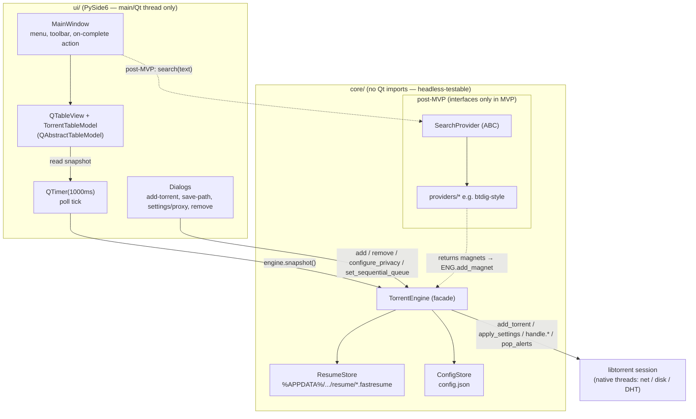

# Architecture — pytorrent-desktop

Status: MVP design (v0.1). Owned by system-architect. Turns the scope in
[`SCOPE.md`](SCOPE.md) and the scaffold in
[`core/engine.py`](../src/pytorrent_desktop/core/engine.py) into implementation-ready
decisions and contracts. **No production code here** — the developer implements
against this doc.

All API facts below were verified against the pinned `libtorrent==2.0.13`
(`lt.version == "2.0.13.0"`) in this repo's `.venv`. Where the scaffold and the
verified library disagree, the correction is called out with **[CORRECTION]**.

---

## 1. Context & guiding constraints

| Constraint | Value | Consequence for design |
|---|---|---|
| Engine | `libtorrent==2.0.13` (2.0.x ABI) | 2.0 API: `state` is an enum, `paused`/`auto_managed` are *flags*; `info_hash()` v1-oriented; resume via `add_torrent_params` round-trip. |
| GUI | PySide6 6.7–6.9 | Qt owns the main thread + event loop. |
| Python | 3.11–3.13 | No 3.14 wheel for libtorrent yet; packaging must target 3.12/3.13. |
| Layering | `core/` has **zero Qt imports**; `ui/` never imports `libtorrent` | The `TorrentEngine` facade is the only seam. Enforced by a lint/test rule. |
| MVP concurrency | 1s `QTimer` polling `engine.snapshot()` | No callbacks from libtorrent threads into Qt in MVP. Alert-driven is post-MVP. |
| Platform | Windows-first, ships as PyInstaller `.exe` | Paths use `%APPDATA%`; packaging bundles the native `libtorrent` `.pyd` + Qt DLLs. |

### Design principles
1. **The facade is the contract.** `ui/` depends only on `TorrentEngine` +
   `TorrentStatus` (plain dataclass). No `lt.*` type ever crosses the seam.
2. **Right-size for MVP.** Polling over an alert thread; a flat file layout over a
   database; synchronous `add_torrent` over async. Each has a documented post-MVP
   upgrade path that does not change the facade signature.
3. **Data safety is non-negotiable.** The one place we must get exactly right is the
   shutdown resume-data flush (§4.3). Everything else can be re-derived; a torrent
   re-checked from scratch on every launch is a correctness failure even if nothing
   crashes.

---

## 2. Component diagram



### Data flow (MVP steady state)
1. User acts in a dialog → `ui/` calls a `TorrentEngine` method (main thread).
2. `TorrentEngine` calls into the libtorrent session; libtorrent's own threads do
   the network/disk work.
3. Every 1000 ms the `QTimer` fires on the main thread → `engine.snapshot()` reads
   each handle's current `status()` and returns a `list[TorrentStatus]`.
4. `TorrentTableModel` diffs the snapshot into its rows and emits `dataChanged`;
   the view repaints. **No data flows UI→libtorrent except through explicit facade
   calls; nothing flows libtorrent→UI except by the UI pulling `snapshot()`.**

### Module map
```
src/pytorrent_desktop/
  __main__.py            entry point; builds engine + QApplication + MainWindow
  core/
    engine.py            TorrentEngine, TorrentStatus  (exists — extend per §3)
    resume.py            ResumeStore (new — §5)
    config.py            ConfigStore, AppPaths (new — §7)
    errors.py            engine exception types (new — §8)
    search/              post-MVP; base.py = SearchProvider ABC (§9)
  ui/
    app.py               QApplication wiring, 1s QTimer
    main_window.py       MainWindow
    torrent_model.py     TorrentTableModel (QAbstractTableModel)
    dialogs/             add_magnet, save_path, settings, remove_confirm
```

---

## 3. `TorrentEngine` API contract

The facade is **single-thread-affine**: all methods are designed to be called from
the Qt main thread only. This is a deliberate MVP simplification — it removes the
need for locking around `self._handles`. It is documented and enforced (a debug
assert on `threading.get_ident()`), and it is compatible with the alert-driven
post-MVP model, where a worker thread posts results back to the main thread via a
Qt signal rather than calling the engine directly.

### 3.1 `TorrentStatus` — finalized fields

The scaffold dataclass is extended. Every field maps to a verified 2.0.13
`torrent_status` attribute (all confirmed present). `frozen=True` is kept so
snapshots are safe to hand to the model as immutable value objects.

| Field | Type | Source (`s = handle.status()`) | Notes |
|---|---|---|---|
| `info_hash` | `str` | key in `_handles` (hex v1) | Stable row identity; see §3.5 on `info_hashes()`. |
| `name` | `str` | `s.name` or `"(fetching metadata…)"` | Empty until metadata for magnets. |
| `total_bytes` | `int` | `s.total_wanted` | Selected-bytes total; `0` pre-metadata. |
| `downloaded_bytes` | `int` | `s.total_wanted_done` | **added** — enables "X of Y" text. |
| `progress` | `float` | `s.progress` | 0.0–1.0. |
| `download_rate` | `int` | `s.download_rate` | bytes/s. |
| `upload_rate` | `int` | `s.upload_rate` | bytes/s. |
| `num_peers` | `int` | `s.num_peers` | Total connected peers. |
| `num_seeds` | `int` | `s.num_seeds` | **added** — MVP list shows peers; cheap to carry. |
| `state` | `str` | `_STATE_LABELS[s.state]` | Enum→label (§3.4). |
| `is_paused` | `bool` | `bool(s.flags & lt.torrent_flags.paused)` | Flag, not a state. |
| `is_finished` | `bool` | `s.progress >= 1.0` or state in {finished, seeding} | **added** — drives on-complete action (§9 of scope). |
| `queue_position` | `int` | `s.queue_position` | **added** — `-1` when not queued/seeding; drives queue UI (§6). |
| `error` | `str \| None` | `str(s.errc.message()) if s.errc.value() else None` | **added** — surfaces per-torrent errors (§8). |
| `save_path` | `str` | `s.save_path` | **added** — needed by "open folder" + remove dialog. |

**[CORRECTION] on the scaffold:** libtorrent 2.0 has **no `error` state** in the
`states` enum and **no `queued`/`allocating` state**. Errors are reported via
`status().errc`, and paused/queued are conveyed by flags + `queue_position`. So the
snapshot must read `errc` explicitly — a torrent with a fatal error otherwise shows
a stale non-error label. The scaffold `_STATE_LABELS` already covers the full 2.0
enum (`checking_files`, `downloading_metadata`, `downloading`, `finished`,
`seeding`, `checking_resume_data`); keep it, add the `errc` read.

### 3.2 Method contract table

Threading column: **main** = must be called on the Qt main thread. All methods are
synchronous and return quickly (they enqueue work into libtorrent; they do not
block on network/disk) **except** `shutdown()`, which blocks up to a bounded
timeout on the resume flush (§4.3).

| Method | Signature | Input contract | Returns | Raises | Thread |
|---|---|---|---|---|---|
| `__init__` | `(config: EngineConfig \| None = None)` | See §3.3 — takes a config object, not a bare port. | — | `EngineInitError` if session can't bind. | main |
| `describe` | `() -> str` | — | `"libtorrent 2.0.13.0"` | — | any (read-only const) |
| `add_torrent_file` | `(torrent_path, save_path) -> str` | `torrent_path` exists & parses; `save_path` is a writable dir. | `info_hash` (hex) | `InvalidTorrentError`, `DuplicateTorrentError`, `SavePathError` | main |
| `add_magnet` | `(magnet_uri, save_path) -> str` | `magnet_uri` is a valid `magnet:?xt=urn:btih:` (or btmh) URI. | `info_hash` (hex) | `InvalidMagnetError`, `DuplicateTorrentError`, `SavePathError` | main |
| `pause` | `(info_hash) -> None` | `info_hash` is known. | — | `UnknownTorrentError` | main |
| `resume` | `(info_hash) -> None` | known | — | `UnknownTorrentError` | main |
| `remove` | `(info_hash, *, delete_data=False) -> None` | known | — | `UnknownTorrentError` | main |
| `snapshot` | `() -> list[TorrentStatus]` | — | one entry per known handle, engine order | — (never raises; per-torrent errors go in `TorrentStatus.error`) | main |
| `set_sequential_queue` | `(one_at_a_time: bool) -> None` | — | — | — | main |
| `move_in_queue` | `(info_hash, direction: Literal["up","down","top","bottom"]) -> None` | known | — | `UnknownTorrentError` | main |
| `configure_privacy` | `(cfg: ProxyConfig \| None) -> None` | `None` disables proxy (direct mode). | — | `ProxyConfigError` (bad host/port) | main |
| `save_all_resume` | `(timeout_s: float = 5.0) -> int` | — | count persisted | — | main (blocks ≤ timeout) |
| `shutdown` | `(timeout_s: float = 10.0) -> None` | idempotent | — | — (best-effort; logs failures) | main (blocks ≤ timeout) |

### 3.3 Config objects (replace the bare `listen_port` int)

`__init__` should take a small frozen dataclass so packaging/tests can inject
paths and the settings surface can grow without signature churn:

```
EngineConfig:  listen_port: int = 6881
               data_dir: Path                # AppPaths.data_dir (§7)
               enable_dht: bool = True
               proxy: ProxyConfig | None = None
               sequential_queue: bool = True   # scope §6 default

ProxyConfig:   host: str
               port: int
               username: str | None = None
               password: str | None = None
               kill_switch: bool = True
```

### 3.4 State mapping (keep as-is, verified)
`_STATE_LABELS` maps the six 2.0 `torrent_status.states` members. `snapshot()`
falls back to `str(s.state)` for unknown values — retain that defensively.

### 3.5 Identity note — `info_hash()` vs `info_hashes()`
The scaffold uses `str(handle.info_hash())` (hex). In 2.0, `info_hash()` is the
v1-oriented accessor and is deprecated in favor of `info_hashes()` (v1/v2 pair).
For MVP (v1 torrents/magnets) `info_hash()` is fine and produces a stable 40-hex
key. **Decision:** keep `info_hash()` for MVP to avoid churn, but centralize it in
one private helper `_key(handle) -> str` so a later switch to
`handle.info_hashes().v1` touches one line. Duplicate detection (§8) keys on this
string.

---

## 4. Concurrency model

### 4.1 Thread inventory
- **libtorrent-internal threads (native, owned by the session):** network I/O,
  disk I/O, DHT, and a hasher pool. We never touch these directly; we only submit
  work (add/pause/settings) and drain alerts.
- **Qt main thread (ours):** the *only* thread that touches `TorrentEngine`,
  `self._handles`, the model, and any widget. The `QApplication` event loop lives
  here.
- **MVP has no worker thread of our own.** This is the key simplification.

### 4.2 The 1-second polling loop (MVP)
- A single `QTimer(interval=1000, parent=MainWindow)` connected to a slot that
  calls `engine.snapshot()` and feeds the result to `TorrentTableModel.apply()`.
- `snapshot()` calls `handle.status()` per handle. For the MVP's expected torrent
  count (single-digit; sequential queue means one active) this is trivially cheap.
- **Why polling, not alerts, for MVP:** `handle.status()` is a synchronous local
  read; it needs no cross-thread marshaling and no alert-queue draining. It cannot
  miss transient events, because the UI only ever shows *current* state, never an
  event log. Simplicity wins at this scale.
- **[Performance guard]** If the list grows large post-MVP, switch the read side to
  `session.post_torrent_updates()` + one `state_update_alert` drained on the timer
  tick (delta updates), still on the main thread. This does not change the facade —
  `snapshot()` can internally maintain a cache updated from alerts. Full
  alert-driven push (a worker thread emitting a Qt signal) is the later step and is
  the reason `configure_privacy`/adds remain synchronous now.

### 4.3 Termination sequence — the data-loss seam (most important)

**Goal:** an in-progress download must resume on next launch without re-checking or
re-downloading. That requires resume data to be written *after* libtorrent has
produced it. `save_resume_data()` is **asynchronous**: it returns immediately and
the data arrives later as a `save_resume_data_alert`. Writing the file before that
alert = data loss. The exact ordering:

```
shutdown(timeout_s):
  1. session.pause()                       # stop new peer/piece activity
  2. (optional) apply a short stop-tracker announce; not required for resume safety
  3. outstanding = 0
     for handle in self._handles.values():
         if not handle.is_valid(): continue
         handle.save_resume_data(
             lt.torrent_handle.save_info_dict          # so magnet torrents reload
             | lt.torrent_handle.flush_disk_cache      # durable on-disk state
         )                                             # NOTE: omit only_if_modified at shutdown
         outstanding += 1
  4. deadline = now + timeout_s
     while outstanding > 0 and now < deadline:
         session.wait_for_alert(200ms)                # block up to 200ms for the next batch
         for a in session.pop_alerts():
             if isinstance(a, lt.save_resume_data_alert):
                 buf = lt.write_resume_data_buf(a.params)   # 2.0 API — bencoded bytes
                 ResumeStore.write(key_from(a.params), buf) # atomic write (§5)
                 outstanding -= 1
             elif isinstance(a, lt.save_resume_data_failed_alert):
                 log.warning("resume save failed: %s", a.error.message())
                 outstanding -= 1                      # MUST decrement or we hang to timeout
  5. if outstanding > 0: log.warning("%d torrents did not flush before timeout", outstanding)
  6. del self._session   # drop the session; native threads join on destruction
```

Verified 2.0.13 facts this depends on (all probed present): the flags
`save_info_dict`, `flush_disk_cache`, `only_if_modified` on `lt.torrent_handle`;
the alerts `save_resume_data_alert` and `save_resume_data_failed_alert`; the helper
`lt.write_resume_data_buf`; and `session.wait_for_alert` / `pop_alerts` /
`is_valid` / `need_save_resume_data`.

**Critical rules for the developer:**
- **Always decrement `outstanding` on the *failed* alert too.** The #1 way this hangs
  is counting only successes; a torrent that has no metadata yet (magnet still
  fetching) will fail-alert, and if you don't count it you block until timeout.
- **`save_info_dict` is required** so a magnet-added torrent that has fetched
  metadata can be reloaded from resume data without re-downloading the metadata.
- **`only_if_modified` is for the *periodic* saver, not shutdown.** At shutdown save
  unconditionally; periodically, gate on `handle.need_save_resume_data()` to avoid
  needless disk churn.
- **`shutdown()` is idempotent** (guard on a `self._closed` flag) — it is wired to
  both `QApplication.aboutToQuit` and the `MainWindow.closeEvent`; both can fire.
- The scaffold's current `shutdown()` only calls `session.pause()` — that is the
  TODO this section closes.

### 4.4 The on-complete action (scope §9)
Evaluated on the poll tick: when the sequential queue drains (no torrent in a
downloading/checking/metadata state and at least one finished this session), and
the opt-in action is armed, `MainWindow` triggers quit or system shutdown. System
shutdown on Windows = `ctypes` call to `ExitWindowsEx`/`shutdown.exe /s /t`;
**always run `engine.shutdown()` first** so resume data is flushed before the OS
goes down.

---

## 5. Resume-data persistence

### 5.1 What / when / where / format
- **What:** one `.fastresume` file per torrent = the bencoded buffer from
  `lt.write_resume_data_buf(alert.params)`. With `save_info_dict`, this includes the
  info-dict, so magnet torrents survive restarts without re-fetching metadata.
- **Where:** `%APPDATA%\pytorrent-desktop\resume\<info_hash>.fastresume`
  (one flat directory, filename = 40-hex info-hash → collision-free, human-greppable).
- **Format:** libtorrent's bencoded resume blob (opaque; we never parse it, we round-
  trip it through `read_resume_data`/`write_resume_data_buf`).
- **When it is written:**
  1. **On add** — immediately after a successful add, request one save so a torrent
     added and then hard-killed still restores its `save_path`/params. (Cheap; the
     first alert arrives within a tick.)
  2. **Periodically** — every 60 s, for each handle where
     `handle.need_save_resume_data()` is true, request a save (gate with
     `only_if_modified`-style logic). This bounds worst-case loss to ~60 s of piece
     progress on a crash/power-loss.
  3. **On `torrent_finished_alert`** — save once so a completed torrent restores as
     seeding, not re-checking.
  4. **On shutdown** — the full flush of §4.3.
- The periodic + finished saves share the *same* alert-drain path as shutdown; the
  poll-tick alert drain (§4.2 performance guard) handles `save_resume_data_alert`
  by writing the file whenever one appears, regardless of what requested it.

### 5.2 Atomic write
Write to `<info_hash>.fastresume.tmp` then `os.replace()` onto the final name.
`os.replace` is atomic on Windows/NTFS, so a crash mid-write never corrupts the
previous good resume file.

### 5.3 Load order (startup)
```
on startup, before showing the window:
  for f in sorted(resume_dir.glob("*.fastresume")):
      buf = f.read_bytes()
      try:    atp = lt.read_resume_data(buf)          # -> add_torrent_params
      except: quarantine(f); continue                 # corrupt/old-format → move to resume/bad/
      atp.save_path = atp.save_path or default_save_path
      apply flags: auto_managed (if sequential queue on), paused-as-persisted
      handle = session.add_torrent(atp)
      self._register(handle)
```
- Torrents are re-added **auto-managed** when the sequential queue is enabled so
  libtorrent restores queue order by `queue_position` (persisted in the resume
  data). See §6.
- A resume file that fails to parse (format drift, truncation) is moved to
  `resume\bad\` rather than deleted — recoverable, and never blocks startup.
- The `.torrent` metadata for file-added torrents lives inside the resume blob via
  `save_info_dict`; we do **not** separately copy the original `.torrent`. (Post-MVP
  we may keep a `torrents/` cache; not needed for MVP.)

---

## 6. Sequential single-download queue (scope §6)

libtorrent already implements one-at-a-time via its auto-managed queue. The design:

- **Session setting:** `active_downloads = 1` (scaffold already does this) when the
  toggle is on; `active_downloads = -1` (unlimited) when off. Also set
  `active_limit` high enough not to cap seeding, and consider
  `dont_count_slow_torrents = True` so a stalled torrent (no peers) doesn't hold the
  single slot forever — verified all three keys apply cleanly.
- **Torrents must be added auto-managed.** This is the TODO the scaffold flags. On
  every add and every resume-load, set `lt.torrent_flags.auto_managed` (unless the
  user explicitly force-started it). Only auto-managed torrents participate in the
  queue; a non-auto-managed torrent bypasses `active_downloads` and would break the
  guarantee.
- **Ordering** is `queue_position` (0 = front). It is persisted in resume data, so
  order survives restarts.
- **UI reorder hook:** `move_in_queue(info_hash, "up"|"down"|"top"|"bottom")` maps to
  `handle.queue_position_up/down/top/bottom()` (all verified present). The table
  either shows a `#` column bound to `TorrentStatus.queue_position` or offers
  right-click "move up/down". After a reorder, the next `snapshot()` reflects new
  positions — no manual model bookkeeping.
- **Semantics to document in the UI:** "sequential single download" governs *how
  many torrents download at once* (one), which is distinct from
  `lt.torrent_flags.sequential_download` (download *pieces* in order within one
  torrent). We do **not** set the per-torrent sequential-download flag; naming in
  settings must avoid that confusion.

---

## 7. Config & data-path layout

Root: `%APPDATA%\pytorrent-desktop\` (i.e. `os.getenv("APPDATA")`, →
`C:\Users\<user>\AppData\Roaming\pytorrent-desktop`). Centralize in an `AppPaths`
helper in `core/config.py` so tests can point it at a temp dir.

```
%APPDATA%\pytorrent-desktop\
  config.json                  app settings (see schema below)
  resume\
    <info_hash>.fastresume     one per torrent (§5)
    bad\                       quarantined unparseable resume files
  logs\
    pytorrent.log              rotating (e.g. 5×1 MB), also stderr in dev
  session\                     (optional) .session_state / DHT node cache for faster warm start
```

`config.json` (MVP schema — versioned so migrations are possible):
```json
{
  "schema_version": 1,
  "listen_port": 6881,
  "default_save_path": "C:\\Users\\me\\Downloads",
  "sequential_queue": true,
  "proxy": { "enabled": false, "host": "", "port": 1080,
             "username": null, "kill_switch": true },
  "on_complete": { "action": "none" }
}
```
- **Secrets:** the SOCKS5 password is **not** stored in `config.json` in plaintext
  for MVP. Options: (a) omit it and prompt per session, or (b) store via Windows
  DPAPI (`win32crypt`/`ctypes CryptProtectData`). MVP decision: store host/port/user,
  keep the password in memory only (prompt on enable). Documented so the settings
  dialog is built accordingly.
- Config is loaded once at startup into `EngineConfig`/UI state and written on
  change (atomic replace, same as §5.2). No live file-watching.
- **PyInstaller note:** never write next to the `.exe` (may be a read-only
  Program Files location). Always use `%APPDATA%`. `AppPaths.ensure()` creates the
  tree on first run.

---

## 8. Error-handling strategy

All engine-raised errors derive from one base `EngineError` (in `core/errors.py`)
so `ui/` can `except EngineError` for a generic dialog and special-case a few. The
engine translates libtorrent exceptions/alerts into these typed errors; **no raw
`RuntimeError` from libtorrent reaches `ui/`.**

| Case | Detection | Engine behavior | UI behavior |
|---|---|---|---|
| **Invalid magnet** | `lt.parse_magnet_uri` raises | raise `InvalidMagnetError(uri)` | inline validation on the add dialog; don't close it |
| **Invalid/corrupt `.torrent`** | `lt.torrent_info(path)` raises | raise `InvalidTorrentError(path)` | error dialog, keep file picker open |
| **Duplicate add (same info_hash)** | key already in `self._handles`, **or** `add_torrent_alert.error` == duplicate | raise `DuplicateTorrentError(info_hash)` (do not add a second handle) | toast "already in list"; select the existing row |
| **Disk full / write failure** | `file_error_alert` / `torrent_error_alert` on the poll drain; surfaced via `status().errc` | mark that torrent's `TorrentStatus.error`; auto-pause it | red row + tooltip with the error message; offer retry/relocate |
| **Save-path not writable / missing** | pre-flight `os.access(dir, W_OK)` + dir exists check before add | raise `SavePathError(path)` | error on the save-path dialog before the download starts |
| **Unknown info_hash** (control call on removed torrent) | key missing in `self._handles` | raise `UnknownTorrentError` | ignored/logged (usually a benign race with removal) |
| **Proxy misconfig** (bad host/port) | validate in `configure_privacy` | raise `ProxyConfigError` | settings dialog validation |
| **Resume save failed** | `save_resume_data_failed_alert` | log, decrement outstanding (§4.3) | none (best-effort) |

Cross-cutting:
- **Pre-flight over post-mortem** where cheap: validate magnet syntax and save-path
  writability *before* calling `add_torrent`, so most failures never create a
  half-added handle.
- **Duplicate detection is defense-in-depth:** check the `_handles` map first
  (synchronous, catches re-adds within a session) *and* honor
  `add_torrent_alert.error` (catches races). libtorrent itself rejects a duplicate
  info-hash; we surface it cleanly instead of leaking the exception.
- **Per-torrent errors never crash the app or the snapshot.** `snapshot()` never
  raises; a failing torrent shows up as a row with `error != None`.

---

## 9. post-MVP search-provider interface (sketch only)

Interface only — **no crawler, no bundled providers, no network code in MVP.** This
locks the seam so a btdig-style provider can be dropped in later without touching
`ui/` or `core/engine.py`.

```python
# core/search/base.py  (post-MVP)
from dataclasses import dataclass
from typing import Protocol, runtime_checkable

@dataclass(frozen=True)
class SearchResult:
    title: str
    size_bytes: int | None      # None if the provider can't report size
    seeders: int | None
    leechers: int | None
    magnet: str                 # magnet: URI — the only thing the engine needs

@runtime_checkable
class SearchProvider(Protocol):
    id: str                     # stable key, e.g. "btdig"
    display_name: str           # shown in the provider picker
    requires_optin: bool        # True → gated behind the legal-notice acceptance

    def query(self, text: str, *, limit: int = 50) -> list[SearchResult]:
        """Search third-party service for `text`. Network-bound; run OFF the Qt
        main thread (QThreadPool/worker). Must raise SearchError on failure —
        never partial/garbage results. No result is auto-added; the user picks a
        row, which calls TorrentEngine.add_magnet(result.magnet, save_path)."""
```

Integration contract:
- Providers are discovered via an explicit registry (an entry-point list or a
  `providers/__init__.py` map) — **not** auto-imported from the internet.
- The UI runs `query()` on a worker thread and marshals `list[SearchResult]` back to
  a results table via a Qt signal (this is where the first non-main-thread work
  enters the app; the engine facade stays main-thread-affine because the worker
  only calls `add_magnet` *after* posting back to the main thread).
- Every provider ships `requires_optin=True` for MVP-successor releases; the search
  panel is hidden until the user accepts the legal notice (README/SCOPE). We
  explicitly **do not** build a DHT crawler/indexer and **do not** bundle providers
  targeting piracy sites (scope non-goal).

---

## 10. Packaging architecture

### 10.1 PyInstaller: one-folder vs one-file
| | one-folder (`--onedir`) | one-file (`--onefile`) |
|---|---|---|
| Startup | fast (no unpack) | slower (self-extracts to `%TEMP%` each launch) |
| Native deps (`libtorrent.pyd`, Qt DLLs, `platforms/qwindows.dll`) | sit visibly in the dist dir; easiest to get right | packed; occasional plugin-path issues |
| Distribution | a folder (zip it, or feed to Inno Setup) | a single `.exe` |
| Antivirus friction | lower | higher (self-extractors get flagged more) |

**Decision:** build **one-folder** as the primary artifact.
- It is the reliable base for the post-MVP **Inno Setup** installer (which is how
  end users get a Start-Menu shortcut, uninstaller, and the magnet handler anyway).
- Faster startup and fewer Qt-plugin path surprises.
- Offer a **one-file** `.exe` as a convenience "portable" download for users who
  want a single file, accepting slower start. The scope's acceptance criterion #10
  ("runs from a standalone PyInstaller `.exe` with no Python/env setup") is met by
  either; one-folder still presents a single launchable `.exe` inside its folder.

### 10.2 What must be bundled
- The native **`libtorrent` `.pyd`** and its runtime DLLs (OpenSSL, etc. — usually
  pulled in automatically; verify with a clean-VM smoke test).
- **PySide6/Qt**: the `platforms/qwindows.dll` plugin is mandatory; ensure the
  Qt plugin path is collected (PyInstaller's PySide6 hook handles this, but the
  MVP CI must smoke-test the built `.exe` on a machine without Python/Qt installed —
  this is acceptance criterion #10 and #11).
- Ship the LICENSE and the legal notice.

### 10.3 post-MVP installer + magnet handler (where it plugs in)
- **Inno Setup** consumes the one-folder dist → produces `setup.exe` with shortcuts
  and an uninstaller.
- **Magnet protocol handler** is registered by the installer (not the app) under:
  ```
  HKEY_CLASSES_ROOT\magnet
      (default) = "URL:magnet"
      "URL Protocol" = ""
  HKEY_CLASSES_ROOT\magnet\shell\open\command
      (default) = "\"C:\Path\pytorrent-desktop.exe\" \"%1\""
  ```
  (Per-user installs write to `HKEY_CURRENT_USER\Software\Classes\magnet` to avoid
  needing admin.) The app's entry point must therefore accept a positional
  `magnet:` argument → route it to `add_magnet` (open the app if not running, or
  hand off to a single running instance). Design `__main__.py` now to accept an
  optional URI arg so the handler is a config-only change later.

### 10.4 Build/CI note (for cicd-engineer)
Windows runner, Python 3.12 (wheel availability), `uv pip install -e ".[build]"`,
`pyinstaller` spec checked into repo, then a **smoke test that launches the built
`.exe` on a clean runner and downloads a small lawful torrent to 100%** — this is
scope acceptance criteria #10 + #11 and should gate a release tag.

---

## Open questions / risks

1. **SOCKS5 UDP for DHT** (see §11 privacy): if the proxy lacks UDP ASSOCIATE,
   DHT/uTP can't be proxied. Kill-switch design (disable DHT/LSD/UPnP when
   `kill_switch` on) sidesteps this but reduces peer discovery to tracker-only.
   Confirm expected UX with product-lead.
2. **`force_proxy` is a deprecated 2.0 alias** — present and accepted by
   `apply_settings` (verified), but `anonymous_mode` + `proxy_hostnames` is the
   authoritative mechanism. See §11.
3. **Password storage** (§7): MVP keeps it in memory; confirm whether users will
   tolerate re-entering it per session vs. investing in DPAPI now.
4. **v2/hybrid torrents:** MVP keys on `info_hash()` (v1). Hybrid torrents work but
   the key helper (`_key`) must be the single switch point if we later need
   `info_hashes().v1`.

---

## 11. Privacy / kill-switch design (scope §8) — detailed

This is the security-sensitive section; the exact settings combination is verified
against 2.0.13.

### 11.1 Settings applied when a proxy is configured
```python
session.apply_settings({
    "proxy_type": lt.proxy_type_t.socks5,        # or socks5_pw if username set
    "proxy_hostname": cfg.host,
    "proxy_port": cfg.port,
    "proxy_username": cfg.username or "",
    "proxy_password": cfg.password or "",
    "proxy_hostnames": True,          # resolve peer/tracker DNS THROUGH the proxy — anti-DNS-leak
    "proxy_peer_connections": True,   # peer connections go via proxy
    "proxy_tracker_connections": True,# tracker announces go via proxy
    "anonymous_mode": True,           # the real enforcement: no identity leak, requires a proxy
    # kill switch (see 11.2): when ON, also disable side channels that bypass the proxy
})
```
All keys above were probed and accepted by `apply_settings` on 2.0.13.

### 11.2 The kill switch — what actually prevents a leak
`anonymous_mode = True` is the load-bearing setting: in anonymous mode libtorrent
routes through the configured proxy and will **not** fall back to direct
connections; with no working proxy, peer/tracker traffic simply does not go out.
That is the kill switch for TCP peer/tracker traffic. **[CORRECTION]** relative to
the scaffold: don't rely on `force_proxy` as the mechanism — it exists in 2.0.13 as
a *deprecated* alias (verified it still applies without error), but the documented,
future-proof guarantee comes from `anonymous_mode` + `proxy_hostnames`. Keep
`force_proxy` if desired for belt-and-suspenders, but the correctness argument rests
on `anonymous_mode`.

Additionally, when `kill_switch` is on, **disable the side channels that can emit
UDP/broadcast traffic outside the proxy**:
```python
{
  "enable_dht": False,      # DHT is UDP; only proxiable if SOCKS5 UDP-ASSOCIATE works — safest off
  "enable_lsd": False,      # Local Service Discovery broadcasts your LAN presence
  "enable_upnp": False,     # UPnP/NAT-PMP talk to your router directly, off-proxy
  "enable_natpmp": False,
}
```
This trades peer-discovery breadth (tracker-only) for a hard no-leak guarantee — the
right default for a privacy feature. Expose it as the meaning of "kill switch ON".

### 11.3 How to verify no leak (test plan for qa-tester)
1. **Positive path:** run behind a known SOCKS5 (e.g. a VPN's SOCKS5 endpoint or a
   local `ssh -D`), add a lawful torrent, confirm peers connect and the peer-visible
   IP (check a tracker/peer-inspection or a torrent IP-check magnet) is the proxy's,
   not the real one.
2. **Kill-switch path (the important one):** with the proxy configured but then
   **stopped** (kill the SOCKS5 process), confirm:
   - No new peer connections form (peer count → 0), and
   - a packet capture (Wireshark on the physical NIC, filtered to exclude the proxy
     host) shows **zero** BitTorrent/DHT/tracker packets leaving directly.
   - Bring the proxy back → peers reconnect. This proves no direct fallback.
3. **DNS path:** confirm tracker hostname lookups do **not** appear as plaintext DNS
   from the host while the proxy is up (validates `proxy_hostnames`).
4. Automate #2 as a release gate where feasible (proxy up→down→up, assert peer count
   and NIC capture).

### 11.4 I2P — post-MVP hook only
Do not implement I2P for MVP. Leave the seam: `proxy_type_t.i2p_proxy` and the
`i2p_hostname`/`i2p_port` settings + `allow_i2p_mixed` exist in 2.0.13 (verified
`allow_i2p_mixed` applies). `ProxyConfig` should carry a `kind` discriminator
(`"socks5" | "i2p"`) so adding I2P later is a new branch in `configure_privacy`, not
a facade change.
```

---

*End of architecture document. Implementation proceeds against the contracts above;
the scaffold's four TODOs (shutdown flush §4.3, resume persistence §5, auto-managed
queue §6, privacy/kill-switch §11) are the MVP-critical build items.*
